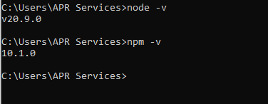

# Activity 0

 ## Activity Overview
In this activity the goal was to validate the installation of both Express and NodeJS by creating a simple hello world application

## Video URL
http:tests

## Screen Shots

Node and NPM Install

