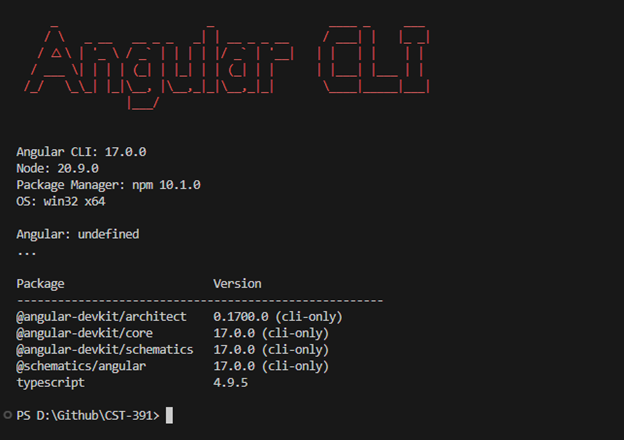
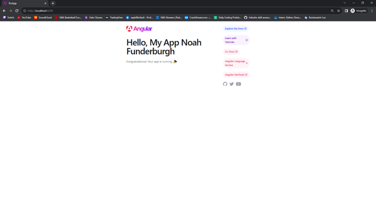
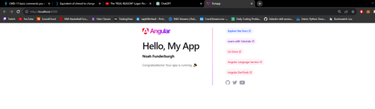

# Activity 2

 ## Activity Overview
In this activity, students will install the development tool and validate the tools installation with a simple test application running on Angular.

## Video URL
http:tests

## Screen Shots

Angular Version

Changing the title within app.component.ts

Adding a message variable and rendering it within h3 tag

