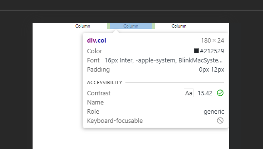
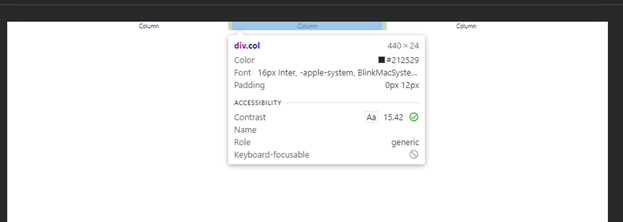
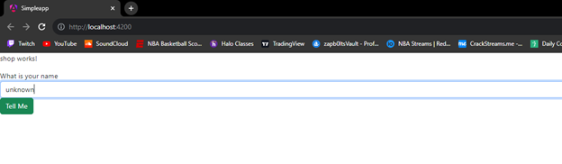
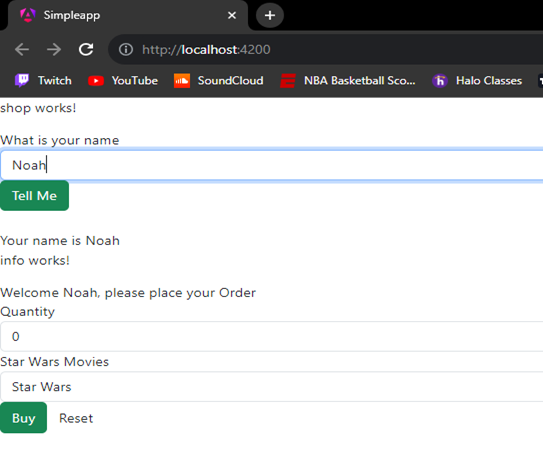
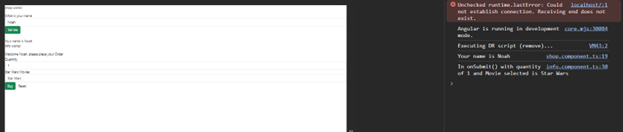
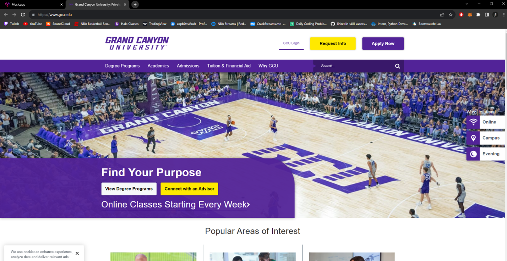
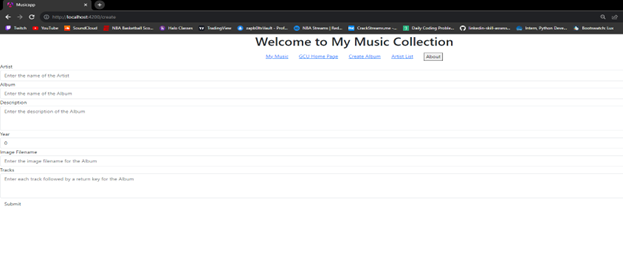
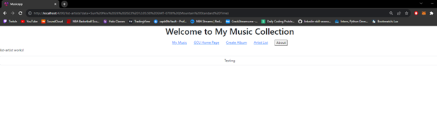
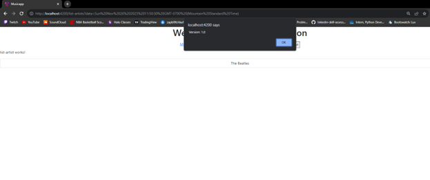

# Activity 3

 ## Activity Overview
In this activity, students will build a simple test application that implements multiple components, handles page events, and binds data to a view template.

## Screen Shots

Bootstrap Small Screen

Bootstrap Large Screen

Before Name Entered

After Name Entered

Dev Tools with console

Initial Page

GCU Home Page

Create Album

Artist List

About Box

## Video URL
http:tests