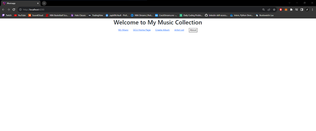
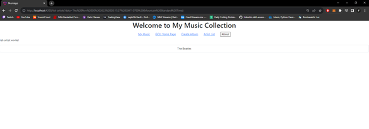
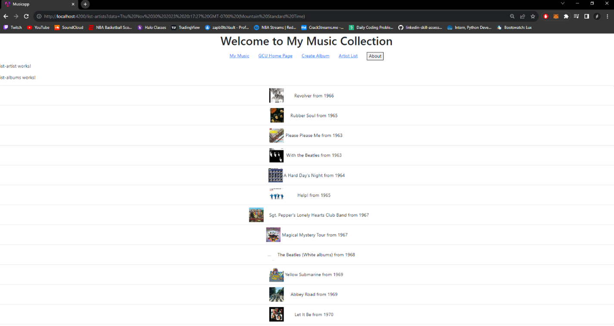
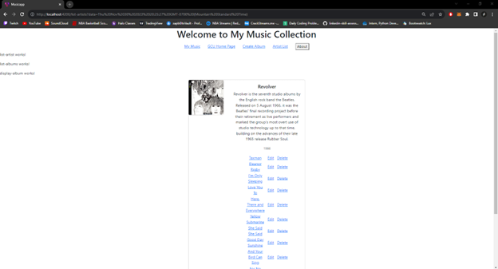
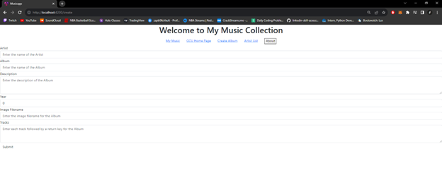

# Activity 4

 ## Activity Overview
In this activity, students will finish building the Music application by integrating the application with the back end services created in Topic 1. Remember that you need to run MAMP and your Express MusicAPI to provide a live data set to your Angular front end applicatio

## Video URL
http:tests

## Screen Shots

Main Application

Artist List

Album List

Album Display with tracks

Add Album

