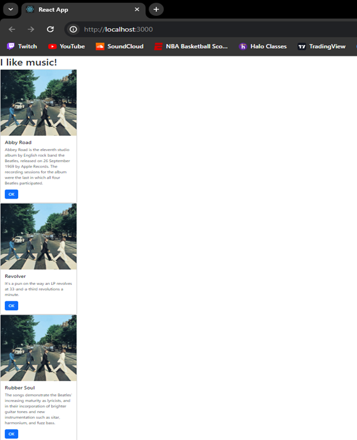
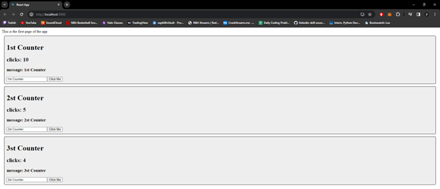
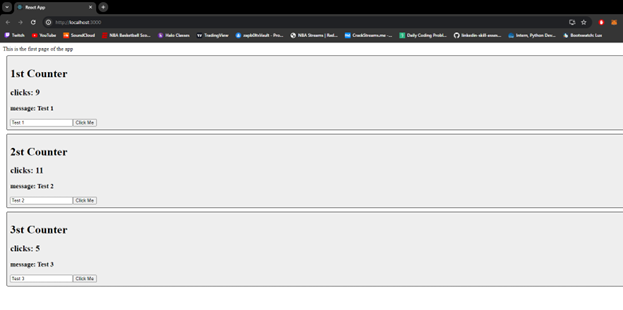
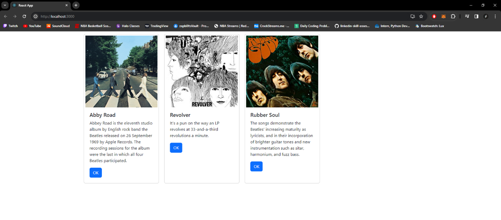

# Activity 5

 ## Activity Overview
In this activity, student will demonstrate state changing through a demo program and then add state changing into the Music application

## Screen Shots

Part 1 - React Music App Intro

Mini App 1 - State Changer

Part 2 - State and props

## Video URL
http:tests