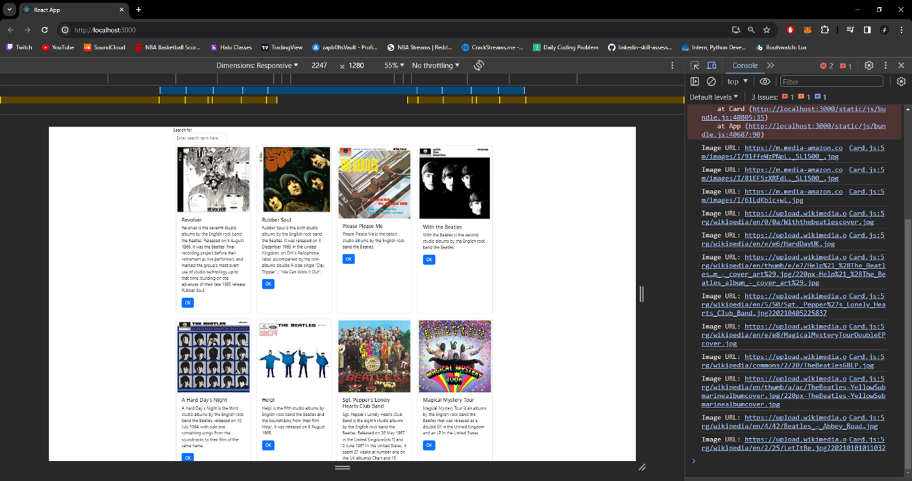
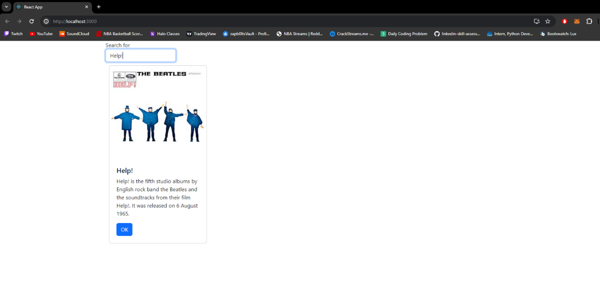
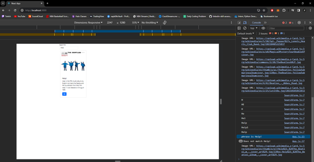
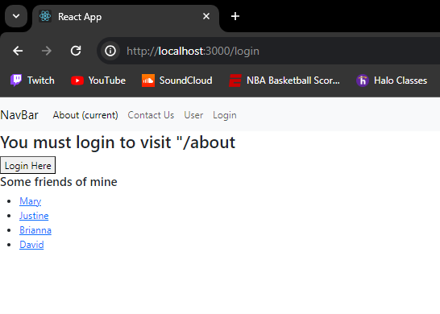
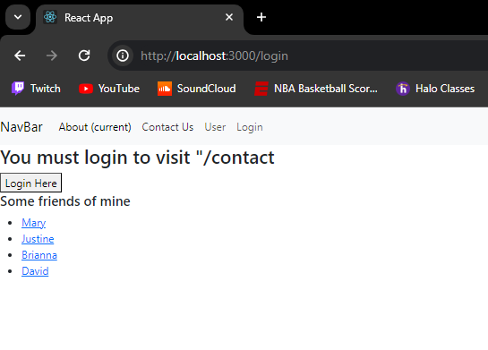
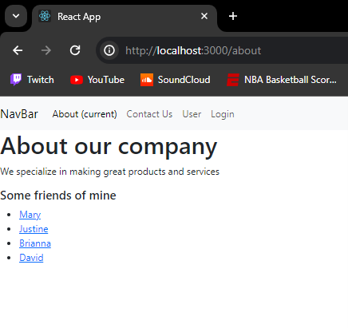
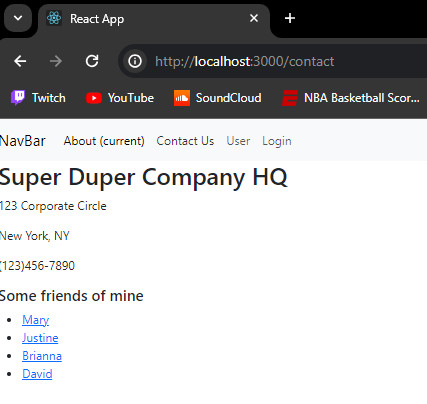
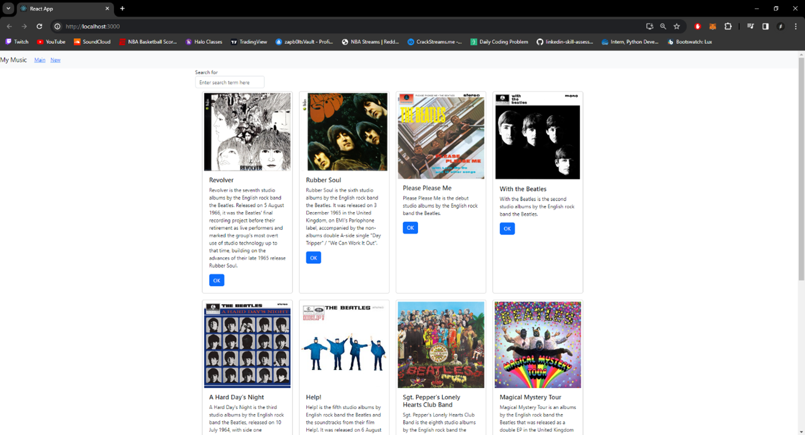
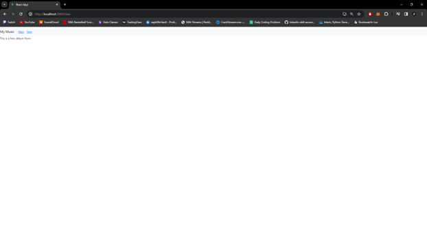
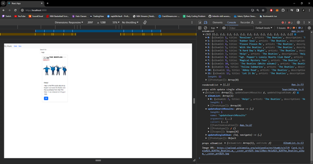

# Activity 6

 ## Activity Overview
In this activity, students will learn how to add external data sources as well as navigation routing

## Video URL
http:tests

## Screenshots

Music App connected to MusicAPI and displaying all albums

Searching for "Help!" Album

Showing console when searching for "Help!" Album

Router App without logging in

Router App after login

Music App Main Page

Music App New Page

Music App Search Filter

